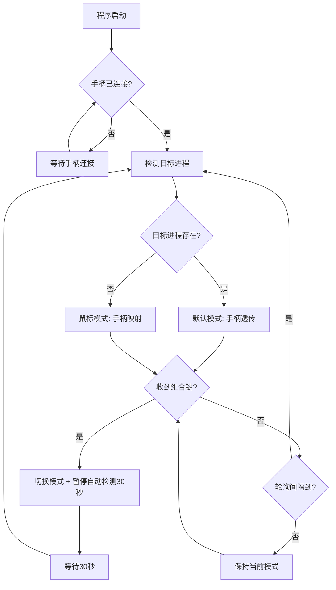

# 手柄鼠标模拟器 - 需求规格说明书

## 项目概述

开发一个 Windows 平台的后台工具，实现手柄与鼠标模式的智能切换。当用户未运行游戏或 Steam 大屏模式时，自动将手柄输入映射为鼠标/键盘操作；在游戏中则原样透传手柄信号。同时支持手动组合键切换模式，方便在游戏间隙操控桌面。
用qt实现
---

## 1. 核心功能需求

### 1.1 自动模式检测与切换

**1.1.1 检测对象**
- 可配置的进程列表，默认包含：
  - `steam.exe`（Steam 客户端主进程）
  - 用户自定义添加的任意 `.exe` 名称（如 `Cyberpunk2077.exe`、`GenshinImpact.exe` 等）
- Steam 大屏模式特殊检测：
  - 检测 `steam.exe` 的命令行参数或窗口标题中是否包含 `Steam Big Picture` 相关标识
  - 或检测注册表/进程特征判断大屏模式状态

**1.1.2 检测逻辑**
- 每 2 秒轮询一次系统进程列表（轮询间隔可配置，范围 1-10 秒）
- 如果检测到列表中**任一进程存在**：
  - 自动切换为**默认模式**（手柄信号原样输出）
- 如果列表中**所有进程均不存在**：
  - 自动切换为**鼠标模式**（手柄映射为鼠标/键盘）
- 手柄断开连接时自动停止所有映射，重连后根据当前检测结果恢复对应模式

**1.1.3 配置扩展**
- 支持通过配置文件（JSON）自定义进程列表、轮询间隔
- 支持通过系统托盘菜单临时禁用自动检测，手动锁定当前模式

---

### 1.2 手动模式切换

**1.2.1 切换组合键**
- 默认组合键：**`View键(Select) + Menu键(Start)` 同时按住 1 秒**
  - View键：Xbox 手柄的 View 键（原 Back 键）
  - Menu键：Xbox 手柄的 Menu 键（原 Start 键）
- 切换行为：在**鼠标模式**和**默认模式**之间来回切换
- 手动切换后，**暂停自动检测 30 秒**（可配置），30 秒后恢复自动检测，避免手动切换被自动检测立即覆盖

**1.2.2 冲突规避说明**
- 此组合键为主流游戏中极少同时使用的两个系统级按键（通常游戏分别用 View 打开地图、Menu 打开菜单，不会要求同时按住）
- 组合键支持在配置文件中自定义

**1.2.3 切换反馈**
- 系统托盘图标变化：鼠标模式显示鼠标图标，默认模式显示手柄图标
- 可选：切换时在屏幕右下角显示短暂半透明 OSD 提示（如"鼠标模式已启用"），2 秒后消失，可通过配置关闭

---

### 1.3 默认模式（手柄透传）

- 手柄所有输入**完全原样输出**，不做任何拦截、转换或映射
- 确保与所有游戏、Steam Input、DS4Windows 等工具兼容
- 程序仅保持后台检测进程状态，不对手柄信号做任何处理

---

### 1.4 鼠标模式（手柄映射）

**1.4.1 摇杆鼠标控制**
- **左摇杆**：控制鼠标光标移动
  - 灵敏度可配置（默认中等），支持独立调节 X/Y 轴灵敏度
  - 摇杆死区可配置（默认 15%），避免漂移
  - 支持加速度曲线：轻推慢速精确定位，推到底快速移动
- **右摇杆**：控制垂直/水平滚轮
  - 上下推：垂直滚动
  - 左右推：水平滚动
  - 滚动速度可配置

**1.4.2 按键映射**

| 手柄按键 | 默认映射功能 |
|----------|------------|
| A | 鼠标左键点击 |
| B | 鼠标右键点击 |
| X | 鼠标中键点击 |
| Y | 按键 `Alt + Tab`（切换程序窗口） |
| 方向键-上 | 按键 `Page Up`（上翻页） |
| 方向键-下 | 按键 `Page Down`（下翻页） |
| 方向键-左 | 媒体上一曲 / `Ctrl+←`（可在配置中切换） |
| 方向键-右 | 媒体下一曲 / `Ctrl+→`（可在配置中切换） |
| 左肩键 LB | 鼠标左键按住（拖拽用，配合左摇杆移动） |
| 右肩键 RB | 鼠标右键按住 |
| 左扳机 LT | 按键 `Win + D`（显示桌面） |
| 右扳机 RT | 按键 `Ctrl + W`（关闭当前窗口/标签页） |
| 左摇杆按下 L3 | 按键 `Enter` |
| 右摇杆按下 R3 | 按键 `Escape` |
| View键 | 按键 `Tab` |
| Menu键 | 按键 `Win`（打开开始菜单） |

**1.4.3 按键映射自定义**
- 所有按键映射支持通过配置文件（JSON）自定义，可映射为：
  - 单个键盘按键（如 `Enter`、`Escape`）
  - 组合键（如 `Alt+Tab`、`Win+D`）
  - 鼠标操作（左键点击、右键点击、中键点击、滚轮上/下）
  - 系统功能（显示桌面、打开任务管理器、锁屏等）
- 预留"无动作"选项，允许禁用某个按键的映射

---

## 2. 系统托盘与用户界面

**2.1 系统托盘**
- 程序启动后最小化到系统托盘，无主窗口
- 托盘图标实时反映当前模式：
  - 鼠标模式：鼠标光标样式图标
  - 默认模式（透传）：手柄样式图标
- 右键菜单包含：
  - 当前模式状态显示（灰色不可点击）
  - 切换模式（手动切换）
  - 锁定当前模式（勾选项，勾选后禁用自动检测）
  - 暂停映射（勾选项，暂停所有手柄映射，恢复手柄原样输出）
  - 分隔线
  - 设置（打开配置文件或简易设置窗口）
  - 退出程序

**2.2 可选设置窗口**
- 简易 GUI 窗口（非必须，初期可用配置文件代替）：
  - 进程列表管理（添加/删除游戏进程名）
  - 摇杆灵敏度、死区、滚动速度调节滑块
  - 组合键自定义录制
  - 恢复默认设置按钮

---

## 3. 技术规格要求

| 项目 | 要求 |
|------|------|
| 平台 | Windows 10/11 64位 |
| 手柄支持 | Xbox 手柄（XInput）、兼容 XInput 的第三方手柄 |
| 扩展支持（可选） | PlayStation 手柄（DualShock 4 / DualSense），通过模拟 XInput 或原生 DInput 支持 |
| 开发语言 | 建议 C# (.NET 6/8) + Windows API，或 Rust + winapi |
| 配置文件 | JSON 格式，支持热加载（修改配置后无需重启） |
| 资源占用 | 后台 CPU 占用 < 1%，内存 < 50MB |
| 启动方式 | 支持开机自启动（通过注册表 Run 键或启动文件夹，可在设置中开关） |
| 管理员权限 | 无需管理员权限运行（除非需要注入游戏进程，应避免） |

---

## 4. 配置文件示例

```json
{
  "monitoring": {
    "process_list": ["steam.exe", "Cyberpunk2077.exe", "cs2.exe"],
    "polling_interval_seconds": 2,
    "manual_switch_lockout_seconds": 30
  },
  "combo_key": {
    "buttons": ["View", "Menu"],
    "hold_duration_ms": 1000
  },
  "mouse_mode": {
    "left_stick": {
      "sensitivity_x": 1.0,
      "sensitivity_y": 1.0,
      "deadzone": 0.15,
      "acceleration": true
    },
    "right_stick": {
      "scroll_speed_vertical": 1.0,
      "scroll_speed_horizontal": 1.0,
      "deadzone": 0.15
    },
    "button_mapping": {
      "A": "MouseLeftClick",
      "B": "MouseRightClick",
      "X": "MouseMiddleClick",
      "Y": "Alt+Tab",
      "DpadUp": "PageUp",
      "DpadDown": "PageDown",
      "DpadLeft": "MediaPreviousTrack",
      "DpadRight": "MediaNextTrack",
      "LB": "MouseLeftHold",
      "RB": "MouseRightHold",
      "LT": "Win+D",
      "RT": "Ctrl+W",
      "L3": "Enter",
      "R3": "Escape",
      "View": "Tab",
      "Menu": "Win"
    }
  },
  "osd": {
    "enabled": true,
    "duration_seconds": 2
  },
  "autostart": false
}
```

---

5. 行为流程图



---

6. 注意事项与边界条件

1. 多手柄场景：暂只处理第一个连接的手柄（Player 1），其余手柄不做映射，但也不拦截。
2. 锁屏/屏保：检测到系统锁屏或屏保状态时，自动暂停手柄映射，恢复后继续。
3. UAC 弹窗：当出现 UAC 权限提升弹窗时，手柄映射可能暂时失效，属于预期行为（安全桌面隔离），不需特殊处理。
4. 与其他手柄工具共存：默认模式下手柄完全透传，不应与 Steam Input、DS4Windows、reWASD 等冲突。鼠标模式下手柄信号被拦截，游戏不会收到手柄输入。退出程序后所有手柄状态立即恢复正常。
5. 性能：使用基于事件的手柄输入监听（而非轮询），降低 CPU 占用。进程检测使用轻量级 API，避免遍历所有窗口。